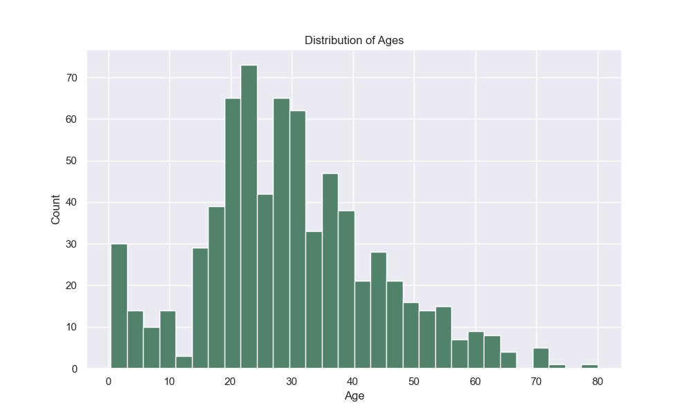
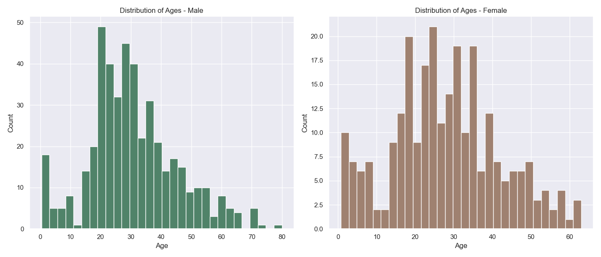
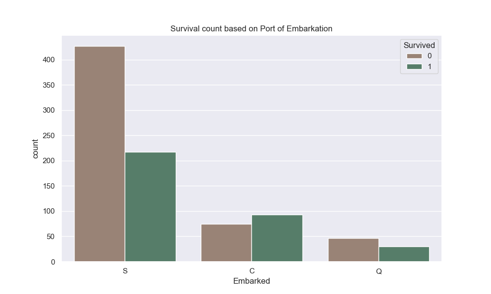
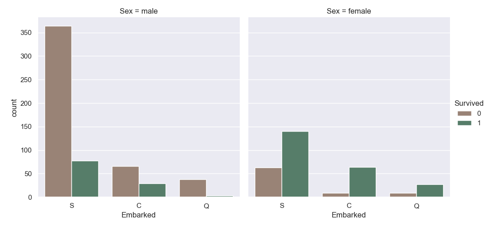
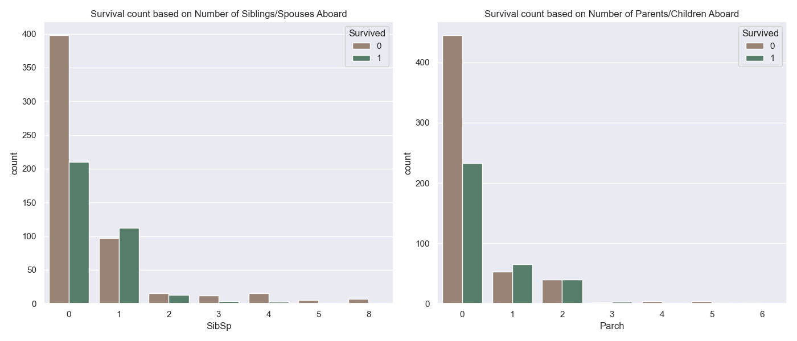
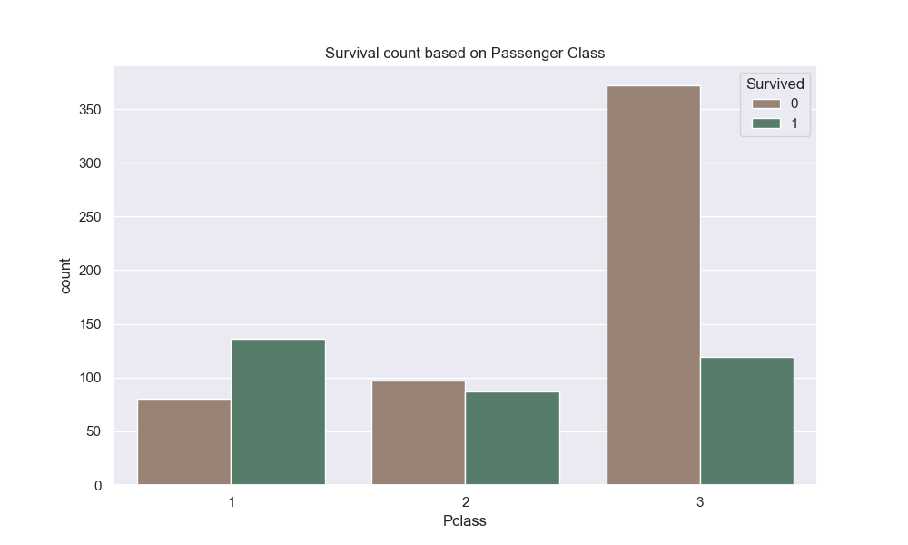

# **Bar Graphs Visualization** 📊

This repository showcases a series of bar graphs generated from the Titanic dataset, highlighting different aspects of the data.

## **Table of Contents**

1. [Introduction](#introduction)
2. [Visualizations](#visualizations)
   - [Age Distribution](#age-distribution)
   - [Age Distribution by Gender](#age-distribution-by-gender)
   - [Survival Rates by Embarkation Point](#survival-rates-by-embarkation-point)
   - [Survival Rates by Embarkation Point and Gender](#survival-rates-by-embarkation-point-and-gender)
   - [Survival Rates by Family Size](#survival-rates-by-family-size)
   - [Survival Rates by Passenger Class](#survival-rates-by-passenger-class)
3. [Feature Engineering Notebook](#feature-engineering-notebook)
4. [Pivot Table Analysis](#pivot-table-analysis)
5. [License](#license)

## **Introduction**

This project involves analyzing the Titanic dataset to extract meaningful insights through various bar graph visualizations. The visualizations aim to provide a clear understanding of the distribution and survival rates of passengers based on different attributes.

## **Visualizations**

### Age Distribution

This bar graph displays the distribution of passengers' ages.

### Age Distribution by Gender

This visualization shows the age distribution segmented by gender.

### Survival Rates by Embarkation Point

This chart illustrates survival rates based on passengers' embarkation points.

### Survival Rates by Embarkation Point and Gender

This graph combines embarkation points and gender to show survival rates.

### Survival Rates by Family Size

This bar graph depicts survival rates relative to family size.

### Survival Rates by Passenger Class

This chart presents survival rates across different passenger classes.

## **Feature Engineering Notebook**

The Jupyter Notebook `cazandra_aporbo_hw8_feature_engineering.ipynb` contains the feature engineering process applied to the dataset, detailing the steps taken to prepare the data for analysis.

## **Pivot Table Analysis**

The file `pivot_table.csv` includes a pivot table summarizing key statistics from the dataset, providing a comprehensive overview of the analyzed data.

## **License**

This project is licensed under the MIT License.

---
